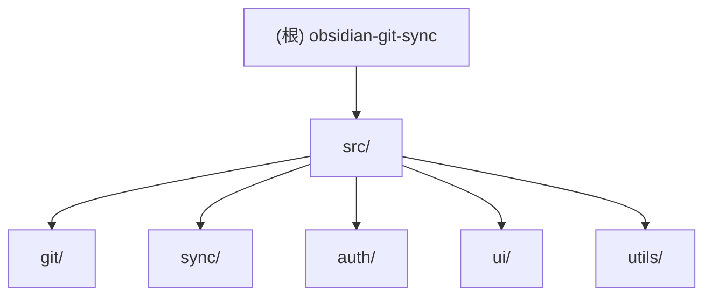

# Obsidian Git Sync

> Obsidian 插件，实现笔记库与 Git 远程仓库（Gitee/GitHub）双向同步

---

## 变更记录 (Changelog)

| 时间 | 变更 |
|------|------|
| 2026-04-05 15:30 | 初始化 AI 上下文文档 |

---

## 项目愿景

一个 Obsidian 插件，实现 Obsidian 笔记库与 Git 远程仓库的双向同步，支持桌面端和移动端跨平台使用。核心特性：

- **双向同步**：Pull -> Push 流程，自动合并远程和本地变更
- **跨平台支持**：桌面端使用系统 Git（SSH 认证），移动端使用 isomorphic-git（Token 认证）
- **冲突处理**：检测冲突后创建备份副本，强制用户手动解决
- **自动同步**：支持启动时同步、定时同步、文件保存触发同步

---

## 架构总览

```
┌─────────────────────────────────────────────────────────────┐
│                    Obsidian Git Sync Plugin                  │
├─────────────────────────────────────────────────────────────┤
│  UI Layer        │  Settings        │  Event Handler         │
│  - Ribbon Icon   │  - Auth Config   │  - Auto Sync Timer     │
│  - Status Bar    │  - Ignore Rules  │  - File Watcher        │
│  - Conflict Modal│  - Trigger Config│  - Manual Trigger      │
├─────────────────────────────────────────────────────────────┤
│                      Sync Manager                            │
│  - Pull Flow     │  - Push Flow     │  - Conflict Handler    │
│  - Ignore Rules  │  - Status Track  │                         │
├─────────────────────────────────────────────────────────────┤
│                    Git Service (抽象层)                      │
│  - NativeGitImpl (桌面端优先)  │  - IsomorphicGitImpl (移动端) │
├─────────────────────────────────────────────────────────────┤
│                      Auth Provider                           │
│  - Token Provider  │  - SSH Provider (未实现)                │
└─────────────────────────────────────────────────────────────┘
                          │
                          ▼
                   Git Remote (HTTPS/SSH)
```

---

## 模块结构图 (Mermaid)



---

## 模块索引

| 模块 | 路径 | 职责 | 入口文件 |
|------|------|------|----------|
| **git** | `src/git/` | Git 操作抽象层，屏蔽底层实现差异 | `git-service.ts` |
| **sync** | `src/sync/` | 同步流程编排、冲突检测与处理 | `sync-manager.ts` |
| **auth** | `src/auth/` | SSH/Token 认证管理 | `auth-provider.ts` |
| **ui** | `src/ui/` | Ribbon 图标、状态栏、冲突弹窗、设置面板 | `settings-tab.ts` |
| **utils** | `src/utils/` | 日志工具、文件操作工具 | `logger.ts` |

---

## 运行与开发

### 环境要求

- Node.js 18+
- Obsidian 0.15.0+

### 开发命令

```bash
# 安装依赖
npm install

# 开发模式（监听文件变化）
npm run dev

# 生产构建
npm run build

# 运行测试
npm run test

# 测试监听模式
npm run test:watch
```

### 安装到 Obsidian

1. 构建插件：`npm run build`
2. 将 `main.js`、`manifest.json`、`styles.css` 复制到 Obsidian 插件目录：
   ```
   .obsidian/plugins/obsidian-git-sync/
   ```
3. 在 Obsidian 设置中启用插件

---

## 测试策略

### 当前状态

- Jest 已配置但**缺少实际测试文件**
- 测试覆盖率：0%
- 需要：单元测试、集成测试、E2E 测试

### 测试优先级

1. **P0**：Git 服务核心操作（pull、push、getStatus）
2. **P0**：同步流程和冲突处理
3. **P1**：认证验证逻辑
4. **P1**：.gitignore 解析

### 测试目标

- 目标覆盖率：80%+
- 关键路径必须覆盖：同步流程、冲突检测、认证

---

## 编码规范

### TypeScript 规范

- 使用 `interface` 定义对象形状，`type` 定义联合/映射类型
- 避免使用 `any`，使用 `unknown` + 安全 narrowing
- 函数参数和返回值必须显式类型注解

### 不可变性

- 使用 spread 操作符进行不可变更新
- 禁止就地修改对象/数组

### 文件组织

- 单文件控制在 400 行以内
- 按功能/领域组织，而非按类型

---

## AI 使用指引

### 推荐工作流

1. **新功能开发**：使用 `tdd-guide` 代理，先写测试再实现
2. **代码审查**：编写代码后立即使用 `code-reviewer` 代理
3. **复杂功能规划**：使用 `planner` 代理创建实现计划
4. **架构决策**：使用 `architect` 代理进行系统设计

### 上下文边界

- 开发 Git 相关功能时，优先读取 `src/git/CLAUDE.md`
- 开发同步功能时，优先读取 `src/sync/CLAUDE.md`
- UI 相关修改时，优先读取 `src/ui/CLAUDE.md`

### 关键约束

- **禁止硬编码密钥**：Token/SSH 私钥必须通过 Obsidian 设置存储
- **禁止静默吞掉错误**：所有错误必须显式处理并通知用户
- **禁止修改 Obsidian 核心文件**：仅操作用户笔记库内容

---

## 文件清单

### 核心文件

```
src/
├── index.ts                 # 插件入口（238 行）
├── types.ts                 # 类型定义（98 行）
├── git/
│   ├── git-service.ts       # Git 抽象接口（91 行）
│   ├── native-git.ts        # 系统 Git 实现（249 行）
│   └── isomorphic-git.ts    # 纯 JS Git 实现（420 行）
├── sync/
│   ├── sync-manager.ts      # 同步管理器（172 行）
│   ├── conflict-handler.ts  # 冲突处理（204 行）
│   ├── ignore-rules.ts      # .gitignore 解析（150 行）
├── auth/
│   ├── auth-provider.ts     # 认证接口（34 行）
│   ├── token-provider.ts    # Token 认证（59 行）
├── ui/
│   ├── ribbon-icon.ts       # Ribbon 图标（105 行）
│   ├── status-bar.ts        # 状态栏（108 行）
│   ├── conflict-modal.ts    # 冲突弹窗（135 行）
│   ├── settings-tab.ts      # 设置面板（253 行）
└── utils/
    ├── logger.ts            # 日志工具（40 行）
    └── file-utils.ts        # 文件操作（101 行）
```

### 配置文件

```
manifest.json        # Obsidian 插件清单
package.json         # NPM 配置
tsconfig.json        # TypeScript 配置
esbuild.config.mjs   # 构建配置
styles.css           # UI 样式
.gitignore           # Git 忽略规则
```

### 设计文档

```
docs/superpowers/specs/2024-04-02-obsidian-git-sync-design.md  # 设计规范
docs/superpowers/plans/2024-04-02-obsidian-git-sync-plan.md    # 实现计划
```

---

## 缺口与下一步

### 缺口清单

| 缺口 | 优先级 | 建议 |
|------|--------|------|
| 缺少单元测试 | P0 | 为 git/sync 模块添加测试 |
| 缺少 Jest 配置文件 | P1 | 创建 `jest.config.js` |
| SSH Provider 未实现 | P1 | 实现 `src/auth/ssh-provider.ts` |
| 缺少 README.md | P2 | 创建项目说明文档 |
| WiFi 检测未实现 | P2 | 实现移动端网络状态检测 |

### 推荐下一步

1. 优先补充 `src/git/` 和 `src/sync/` 的单元测试
2. 创建 `jest.config.js` 配置文件
3. 实现 SSH Provider 完善桌面端认证
4. 创建 README.md 文档

---

*文档生成时间：2026-04-05 15:30:17*